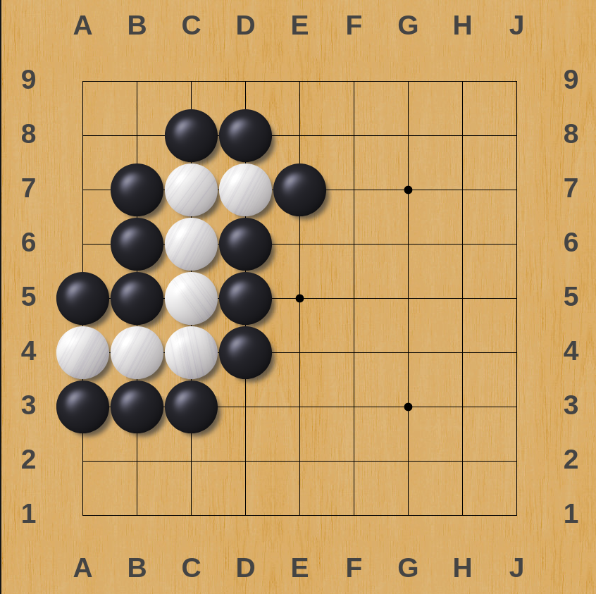
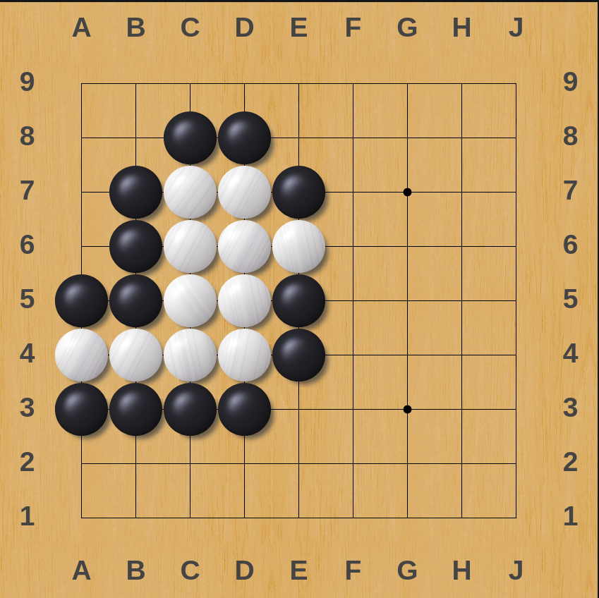

# DD1337 Week 10

To prepare for _DD1338 Algiritmer och Datastrukturer_, let's write in a language that doesn't treat algorithms as a series of calculations, but as an iterative loop through a tree data structure -- hence algoritms and data structures.

## Getting started with Prolog

### SWI-Prolog

1) Install [SWI-Prolog](https://www.swi-prolog.org/). _As a pleb (Windows user), you are entitled to the SWI-prolog-command-prompt profile to add to your Windows Terminal settings. You're welcome._
```json
{
    "acrylicOpacity": 0.75,
    "closeOnExit": true,
    "commandline": "cmd.exe /c \"swipl\"",
    "guid": "{1597a4d0-b666-4b1f-a7d3-79af62638679}",
    "icon": "C:\\Program Files\\swipl\\swipl.ico",
    "name": "SWI-Prolog",
    "useAcrylic": true
}
```
2) _As a pleb (Windows user)_, make sure that your environmental variable is set. Default value:
```
C:\Program Files\swipl\bin
```

Congrats dear programmer. You can now compile and run your Prolog files by entering the following command.

_In your terminal/powershell_:
```
swipl path/to/my-file.pl
```
_In your SWI-Prolog environment_:
```prolog
['path/to/my-file.pl'].
```

### Prepare for your assigment

1) Create a repository named `<KTH_ID>-task-10`.
2) Clone your newly created repository.
3) Create one `.pl` file for the entire assignment.

For help with code setup, begin by copying the contents of `./template/main.pl` into your `.pl` file.

## Assignment

The assignment is to implement a function (called a predicate) in Prolog that calculates whether a group is alive or dead in the game of Go. 

### [Go](https://en.wikipedia.org/wiki/Go_(game))

A group is defined as one or more stones of the same color that are horisontally or vertically adjecent to eachother. If two stones share an adjacent stone of the same color they are considered to be part of the same group. A group is alive if it has atleast one liberty. A liberty is a horisontally or vertically adjacent spot on the board that isn't covered by another stone. A stone at the edge of the board is considered to have one less liberty. Coversely, a stone at the corner of the board is considered to have two less liberties. 

#### Dead group


#### Alive group


Your predicate only needs to be able to handle boards of size 9x9, but it would be nice if it could handle bigger (or smaller) board sizes.

The file `template/main.pl` contains a template for how to read input and a simple predicate that checks the position at `(<column>, <row>)` and returns `true` if it contains a stone.

There are two example boards that you can test your solution on.

## Credits

Thanks to _Isak Larsson, Rustacean-20_ for writing this assignment. 